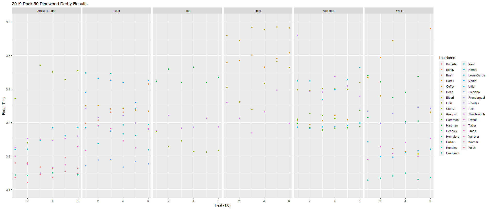
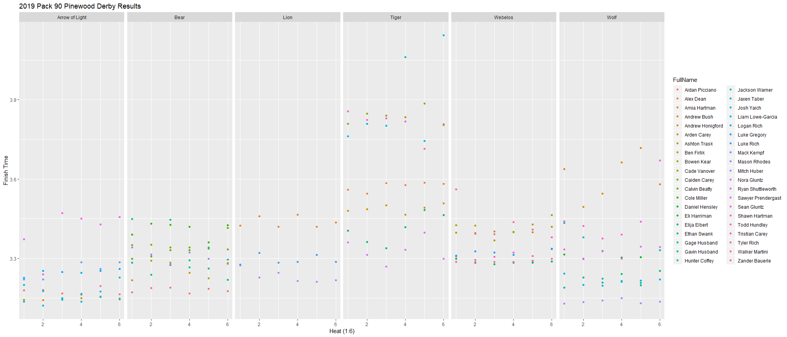
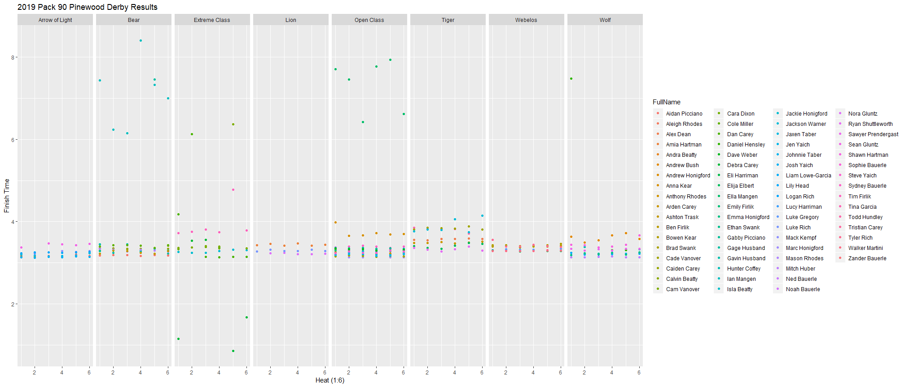
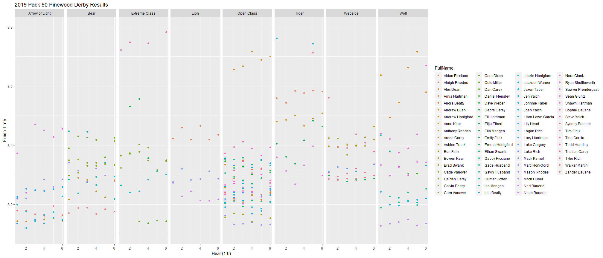
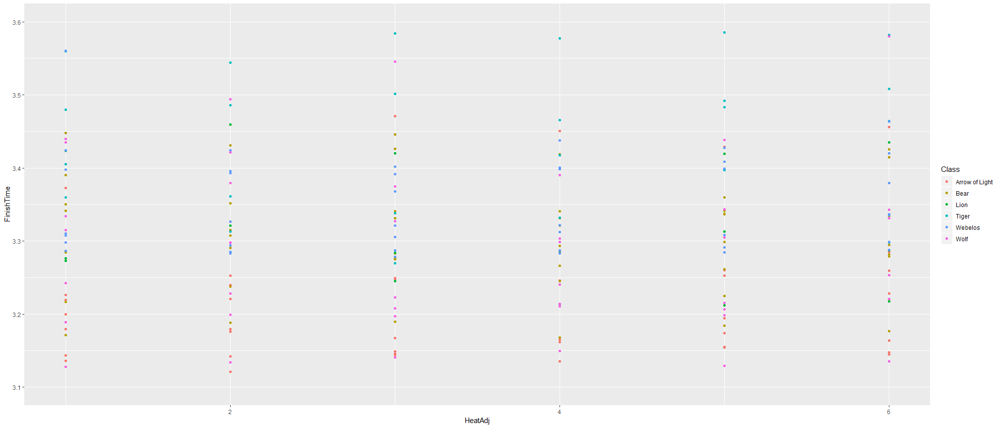
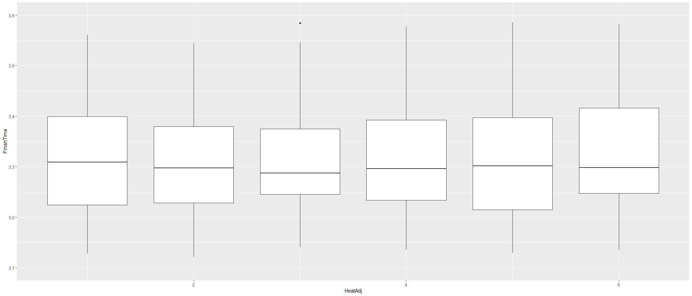
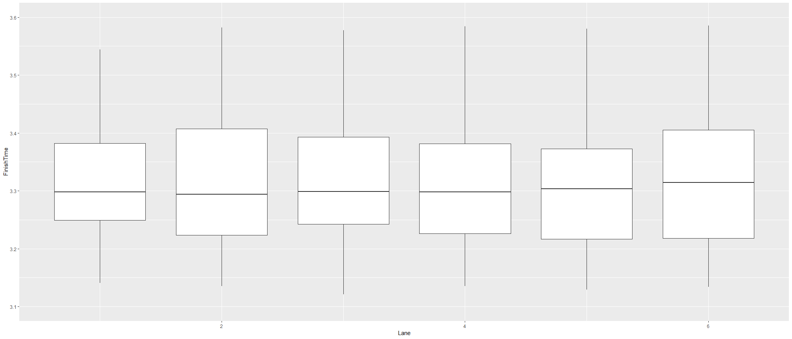

# Pinewood
Pinewood Derby Analysis Pack 90 

### *R File*
The attached [R script][1] provides a number of analytic combinations of the data that I was given from the racing software.

## Data
1. Class - Class rank of participant. 
2. Heat - Heat that the participant participated in.  Each Den ran there own races.
3. Lane - Lane that the participant's care was raced in.
4. FirstName - First name of Participant
5. LastName - Last name of Participant
6. CarNumber - Car identification number
7. FinishTime - Time in Seconds of the cars finish time per heat
8. FinishPlace - Track contained 6 lanes and each racer raced in each lane.  

### *Specifics to the data*
Each racer ran there car 6 times.  Each participant raced in all 6 lanes.  Additional fields were created to normalize the heats (this code may not work for all users).

## Data Analysis 

Install & Load Packages

```r
library(dplyr)
library(tidyr)
library(ggplot2)
```

### *Load Data file*

```r
#Load File
tempderby19 <- read.csv("Pack90Derby-Results.csv")
#convert to Data Frame dplyr package
derby19 <- tbl_df(tempderby19)
#remove old df
rm(tempderby19)
#show sample
head(derby19, 15)
```

```
## # A tibble: 15 x 8
##    Class    Heat  Lane FirstName LastName CarNumber FinishTime FinishPlace
##    <fct>   <int> <int> <fct>     <fct>        <int>      <dbl>       <int>
##  1 Arrow ~     1     1 Zander    Bauerle          1       3.18           3
##  2 Arrow ~     2     4 Zander    Bauerle          1       3.18           2
##  3 Arrow ~     4     3 Zander    Bauerle          1       3.17           4
##  4 Arrow ~     5     6 Zander    Bauerle          1       3.16           2
##  5 Arrow ~     6     2 Zander    Bauerle          1       3.19           4
##  6 Arrow ~     7     5 Zander    Bauerle          1       3.16           3
##  7 Arrow ~     1     5 Sean      Gluntz          12       3.37           6
##  8 Arrow ~     2     1 Sean      Gluntz          12       3.24           5
##  9 Arrow ~     3     4 Sean      Gluntz          12       3.47           6
## 10 Arrow ~     5     3 Sean      Gluntz          12       3.45           6
## 11 Arrow ~     6     6 Sean      Gluntz          12       3.43           6
## 12 Arrow ~     7     2 Sean      Gluntz          12       3.46           6
## 13 Arrow ~     1     2 Andrew    Honigfo~        19       3.14           2
## 14 Arrow ~     2     5 Andrew    Honigfo~        19       3.14           1
## 15 Arrow ~     3     1 Andrew    Honigfo~        19       3.15           2
```

```r
str(derby19)
```

```
## Classes 'tbl_df', 'tbl' and 'data.frame':	414 obs. of  8 variables:
##  $ Class      : Factor w/ 8 levels "Arrow of Light",..: 1 1 1 1 1 1 1 1 1 1 ...
##  $ Heat       : int  1 2 4 5 6 7 1 2 3 5 ...
##  $ Lane       : int  1 4 3 6 2 5 5 1 4 3 ...
##  $ FirstName  : Factor w/ 67 levels "Aidan","Aleigh",..: 67 67 67 67 67 67 56 56 56 56 ...
##  $ LastName   : Factor w/ 38 levels "Bauerle","Beatty",..: 1 1 1 1 1 1 11 11 11 11 ...
##  $ CarNumber  : int  1 1 1 1 1 1 12 12 12 12 ...
##  $ FinishTime : num  3.18 3.18 3.17 3.16 3.19 ...
##  $ FinishPlace: int  3 2 4 2 4 3 6 5 6 6 ...
```

### *Data Manipulation*
I added a few fields to the raw data file. Those fields included:
1. Full Name - Racers full name
2. HeadAdj - Racers ran at different heats depending on pack size, I normalized all heats to be 1:6
3. HeadAdjLane - Combination of HeadAdj and Lane number

```r
#Add full Name to data, Heat Order (dependnet on 6 runs by each racer), combined Heat order and Lane
derby19 <- mutate(derby19, FullName = paste(FirstName, LastName, sep = " "), 
                  HeatAdj = rep(1:6,times = nrow(derby19)/6), HeatAdjLane = paste0(HeatAdj, Lane))
```

```
## Warning: package 'bindrcpp' was built under R version 3.5.2
```

```r
head(derby19, 5)
```

```
## # A tibble: 5 x 11
##   Class  Heat  Lane FirstName LastName CarNumber FinishTime FinishPlace
##   <fct> <int> <int> <fct>     <fct>        <int>      <dbl>       <int>
## 1 Arro~     1     1 Zander    Bauerle          1       3.18           3
## 2 Arro~     2     4 Zander    Bauerle          1       3.18           2
## 3 Arro~     4     3 Zander    Bauerle          1       3.17           4
## 4 Arro~     5     6 Zander    Bauerle          1       3.16           2
## 5 Arro~     6     2 Zander    Bauerle          1       3.19           4
## # ... with 3 more variables: FullName <chr>, HeatAdj <int>,
## #   HeatAdjLane <chr>
```

Initial analysis only conducted on cub scouts. Our pack had an open class which included standard and extreme race cars. 

```r
#subset out class we don't need
derby19scout <- derby19[derby19$Class %in% c("Lion", "Tiger", "Wolf", "Bear", "Webelos", "Arrow of Light"),]
head(derby19scout, 5)
```

```
## # A tibble: 5 x 11
##   Class  Heat  Lane FirstName LastName CarNumber FinishTime FinishPlace
##   <fct> <int> <int> <fct>     <fct>        <int>      <dbl>       <int>
## 1 Arro~     1     1 Zander    Bauerle          1       3.18           3
## 2 Arro~     2     4 Zander    Bauerle          1       3.18           2
## 3 Arro~     4     3 Zander    Bauerle          1       3.17           4
## 4 Arro~     5     6 Zander    Bauerle          1       3.16           2
## 5 Arro~     6     2 Zander    Bauerle          1       3.19           4
## # ... with 3 more variables: FullName <chr>, HeatAdj <int>,
## #   HeatAdjLane <chr>
```

```r
str(derby19scout)
```

```
## Classes 'tbl_df', 'tbl' and 'data.frame':	246 obs. of  11 variables:
##  $ Class      : Factor w/ 8 levels "Arrow of Light",..: 1 1 1 1 1 1 1 1 1 1 ...
##  $ Heat       : int  1 2 4 5 6 7 1 2 3 5 ...
##  $ Lane       : int  1 4 3 6 2 5 5 1 4 3 ...
##  $ FirstName  : Factor w/ 67 levels "Aidan","Aleigh",..: 67 67 67 67 67 67 56 56 56 56 ...
##  $ LastName   : Factor w/ 38 levels "Bauerle","Beatty",..: 1 1 1 1 1 1 11 11 11 11 ...
##  $ CarNumber  : int  1 1 1 1 1 1 12 12 12 12 ...
##  $ FinishTime : num  3.18 3.18 3.17 3.16 3.19 ...
##  $ FinishPlace: int  3 2 4 2 4 3 6 5 6 6 ...
##  $ FullName   : chr  "Zander Bauerle" "Zander Bauerle" "Zander Bauerle" "Zander Bauerle" ...
##  $ HeatAdj    : int  1 2 3 4 5 6 1 2 3 4 ...
##  $ HeatAdjLane: chr  "11" "24" "33" "46" ...
```

Racer was an outlier, and removed from analysis

```r
#Take out Ian
derby19scout <- derby19scout[derby19scout$LastName != "Mangen",]
```

I fixed some outliers who had some odd times

```r
#Fix Data Danny Hensley
danny <- derby19scout[derby19scout$FullName == "Daniel Hensley","FinishTime"]
mean(danny$FinishTime[2:6])
```

```
## [1] 3.3151
```

```r
derby19scout$FinishTime[211]= mean(danny$FinishTime[2:6])
derby19scout$FinishTime[211]
```

```
## [1] 3.3151
```

```r
#Fix Data Gage Husband
Cage <- derby19scout[derby19scout$FullName == "Gage Husband","FinishTime"]
mean(Cage$FinishTime[c(1:4,6)])
```

```
## [1] 3.26158
```

```r
derby19scout$FinishTime[59]= mean(Cage$FinishTime[c(1:4,6)])
derby19scout$FinishTime[59]
```

```
## [1] 3.26158
```

### *Data Summaries*
Summarized racers by Fastest Time

```r
#groupby name, Summarize Data, Arrange by Fastest Time
derby19byname <- group_by(derby19scout, FullName, Class)
derby19Summary <- summarize(derby19byname, AverageFinishTime = mean(FinishTime), FastestTime = min(FinishTime), StandardDeviation = sd(FinishTime))
derby19Summary <- arrange(derby19Summary, AverageFinishTime)
print(derby19Summary)
```

```
## # A tibble: 40 x 5
## # Groups:   FullName [40]
##    FullName      Class       AverageFinishTi~ FastestTime StandardDeviati~
##    <chr>         <fct>                  <dbl>       <dbl>            <dbl>
##  1 Mitch Huber   Wolf                    3.14        3.13          0.00795
##  2 Josh Yaich    Arrow of L~             3.14        3.12          0.0118 
##  3 Andrew Honig~ Arrow of L~             3.15        3.14          0.00449
##  4 Zander Bauer~ Arrow of L~             3.17        3.16          0.0125 
##  5 Aidan Piccia~ Bear                    3.18        3.17          0.00913
##  6 Jaxen Taber   Arrow of L~             3.18        3.15          0.0279 
##  7 Liam Lowe-Ga~ Wolf                    3.21        3.20          0.0166 
##  8 Ethan Swank   Wolf                    3.22        3.19          0.0252 
##  9 Nora Gluntz   Lion                    3.23        3.21          0.0239 
## 10 Logan Rich    Arrow of L~             3.25        3.23          0.0115 
## # ... with 30 more rows
```

Summarized pack class by Fastest Time

```r
#groupby class, Summarize Data, Arrange by Fastest Time
derby19byClass <- group_by(derby19scout, Class)
derby19SummaryClass <- summarize(derby19byClass, AverageFinishTime = mean(FinishTime), FastestTime = min(FinishTime), StandardDeviation = sd(FinishTime))
derby19SummaryClass <- arrange(derby19SummaryClass, AverageFinishTime)
print(derby19SummaryClass)
```

```
## # A tibble: 6 x 4
##   Class          AverageFinishTime FastestTime StandardDeviation
##   <fct>                      <dbl>       <dbl>             <dbl>
## 1 Arrow of Light              3.22        3.12            0.0928
## 2 Bear                        3.30        3.17            0.0754
## 3 Lion                        3.32        3.21            0.0907
## 4 Wolf                        3.32        3.13            0.152 
## 5 Webelos                     3.35        3.28            0.0654
## 6 Tiger                       3.62        3.27            0.221
```
Created table with Lane in Columns and HeatAdjust (HeatAdj) by rows. Essentially a Pivot table

```r
#groupby lane and heat adg, Summarize Data, SpreadLane to columns & HeatAdjust by rows
derby19byLane <- group_by(derby19scout, Lane, HeatAdj)
derby19SummaryLane <- summarize(derby19byLane, AverageFinishTime = mean(FinishTime))
spread(derby19SummaryLane, Lane, AverageFinishTime)
```

```
## # A tibble: 6 x 7
##   HeatAdj   `1`   `2`   `3`   `4`   `5`   `6`
##     <int> <dbl> <dbl> <dbl> <dbl> <dbl> <dbl>
## 1       1  3.36  3.32  3.34  3.36  3.38  3.43
## 2       2  3.38  3.35  3.39  3.31  3.30  3.34
## 3       3  3.27  3.36  3.29  3.40  3.39  3.39
## 4       4  3.44  3.37  3.39  3.32  3.35  3.28
## 5       5  3.36  3.36  3.32  3.40  3.32  3.38
## 6       6  3.42  3.42  3.40  3.34  3.35  3.34
```

## Data Summaries by Finishtime Rank
Ranking a finish time was used to normalize the data. Key questions to solve are:
1. Which lane is faster? 
2. Which heat is faster?
### *Create Finishtime Rank*

```r
#loop created to produce rank for individual. Loop is dependent on each racer having 6 runs
#nrow(derby19scout)/6)
count <- 1
FinishTimeRank <- vector('numeric')
temp2 <- while(count<= (nrow(derby19scout)/6)){
  newcount <- count * 6
  temp <- derby19scout[(newcount-5):newcount, "FinishTime"] 
  temprank <- rank(temp$FinishTime)
  FinishTimeRank <- append(FinishTimeRank, temprank)
  count <- count+1}

#bind column to DF
derby19scout <- cbind(derby19scout, FinishTimeRank)

head(derby19scout)
```

```
##            Class Heat Lane FirstName LastName CarNumber FinishTime
## 1 Arrow of Light    1    1    Zander  Bauerle         1     3.1794
## 2 Arrow of Light    2    4    Zander  Bauerle         1     3.1796
## 3 Arrow of Light    4    3    Zander  Bauerle         1     3.1671
## 4 Arrow of Light    5    6    Zander  Bauerle         1     3.1621
## 5 Arrow of Light    6    2    Zander  Bauerle         1     3.1945
## 6 Arrow of Light    7    5    Zander  Bauerle         1     3.1637
##   FinishPlace       FullName HeatAdj HeatAdjLane FinishTimeRank
## 1           3 Zander Bauerle       1          11              4
## 2           2 Zander Bauerle       2          24              5
## 3           4 Zander Bauerle       3          33              3
## 4           2 Zander Bauerle       4          46              1
## 5           4 Zander Bauerle       5          52              6
## 6           3 Zander Bauerle       6          65              2
```

### *Summaries with FinishTimeRank
Summary of FinishTimeRank by Lane

```r
#summarize time rank by Lane
derby19scout %>% group_by(Lane) %>%  summarize(RankTime = mean(FinishTimeRank))
```

```
## # A tibble: 6 x 2
##    Lane RankTime
##   <int>    <dbl>
## 1     1     3.58
## 2     2     3.44
## 3     3     3.69
## 4     4     3.79
## 5     5     2.84
## 6     6     3.68
```
Summary of FinishTimeRank by HeatAdj

```r
#summarize time rank by HeatAdj
derby19scout %>% group_by(HeatAdj) %>%  summarize(RankTime = mean(FinishTimeRank))
```

```
## # A tibble: 6 x 2
##   HeatAdj RankTime
##     <int>    <dbl>
## 1       1     3.35
## 2       2     3.18
## 3       3     3.28
## 4       4     3.32
## 5       5     3.65
## 6       6     4.22
```
Summary of FinishTimeRank by HeatAdjLane

```r
#summarize time rank by HeatAdjLane
derby19scout %>% group_by(HeatAdjLane) %>%  summarize(RankTime = mean(FinishTimeRank))
```

```
## # A tibble: 36 x 2
##    HeatAdjLane RankTime
##    <chr>          <dbl>
##  1 11              3.57
##  2 12              3.4 
##  3 13              3.11
##  4 14              3.43
##  5 15              2.33
##  6 16              4.33
##  7 21              2.5 
##  8 22              2.57
##  9 23              3   
## 10 24              3.75
## # ... with 26 more rows
```
## **Summary of Analysis**
Findings are as follows:
1. Lane 5 was the fastest time
2. Heat 2 was the fastest time. This made sense as the cars have a lot of graphite, which may provide some friction in the first race. However, the 2:4 races have optimal amounts. Leaving the 5th and 6th race with the slowest results.

## Plot Summaries

```r
#Summary of results broken out by class, color by person, with finish time
qplot(data = derby19scout, HeatAdj, FinishTime, geom = c("point"), aes(group = HeatAdj, color = LastName), 
      facets = .~ Class, ylim = c(3.1,3.6), xlab = "Heat (1:6)", ylab = "Finish Time", main = "2019 Pack 90 Pinewood Derby Results")
```

```
## Warning: Removed 22 rows containing missing values (geom_point).
```

<!-- -->

```r
#Summary of scout NOT LIMITED
qplot(data = derby19scout, HeatAdj, FinishTime, geom = c("point"), aes(group = HeatAdj, color = FullName), 
      facets = .~ Class, xlab = "Heat (1:6)", ylab = "Finish Time", main = "2019 Pack 90 Pinewood Derby Results")
```

<!-- -->

```r
#Summary of ALL Participants
qplot(data = derby19, HeatAdj, FinishTime, geom = c("point"), aes(group = HeatAdj, color = FullName), 
      facets = .~ Class, xlab = "Heat (1:6)", ylab = "Finish Time", main = "2019 Pack 90 Pinewood Derby Results")
```

<!-- -->

```r
#Summary of ALL Particiants LIMITED
qplot(data = derby19, HeatAdj, FinishTime, geom = c("point"), aes(group = HeatAdj, color = FullName), 
      facets = .~ Class, xlab = "Heat (1:6)", ylab = "Finish Time", main = "2019 Pack 90 Pinewood Derby Results", ylim = c(3.1,3.8))
```

```
## Warning: Removed 38 rows containing missing values (geom_point).
```

<!-- -->

```r
#Plot by Time, Heat Adj, colored by class
qplot(data = derby19scout, HeatAdj, FinishTime, geom = c("point"), aes(group = HeatAdj, color = Class), ylim = c(3.1,3.6))
```

```
## Warning: Removed 22 rows containing missing values (geom_point).
```

<!-- -->

```r
#Box plot of same thing as above
qplot(data = derby19scout, HeatAdj, FinishTime, geom = c("boxplot"), aes(group = HeatAdj, color = Class), ylim = c(3.1,3.6))
```

```
## Warning: Removed 22 rows containing non-finite values (stat_boxplot).
```

<!-- -->

```r
#Box plot of Lane and Finish time LIMITED
qplot(data = derby19scout, Lane, FinishTime, geom = c("boxplot"), aes(group = Lane, color = Class), ylim = c(3.1, 3.6))
```

```
## Warning: Removed 22 rows containing non-finite values (stat_boxplot).
```

<!-- -->


[1]: https://github.com/jlalhuber/Pinewood/blob/master/Derby%20Stats.R
